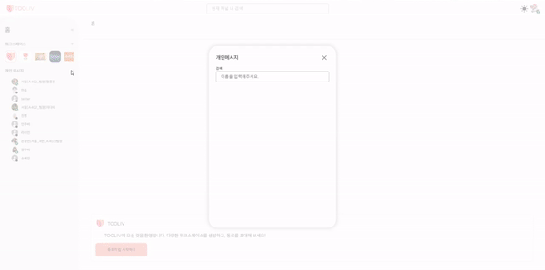

   
  
   
   

## 목차

1. [**서비스 소개**](#1)
2. [**Git Book 보러가기**](#2)
3. [**UCC 보러가기**](#3)
4. [**프로젝트 기간**](#4)
5. [**팀원 소개**](#5)
6. [**기술 스택**](#6)
7. [**시스템 아키텍처**](#7)
8. [**주요 기능**](#8)
9. [**프로젝트 관련 문서**](#9)

 

## 💡 서비스 소개

### 협업을 위한 새로운 선택, TOOLIV

> 친구 및 동료들과 자유롭게 채팅하고,  
> 화상회의를 통해 업무 효율을 높이고 실시간으로 소통해보세요!

 

## 📘 [Git Book 보러가기](https://team-tooliv.gitbook.io/tooliv-docs/)

 

## 🎥 [UCC 보러가기](https://youtu.be/as9xOSGULEI)

 

## 📆 프로젝트 기간

### 22.04.11 ~ 05.20

- 기획 및 설계 : 22.04.11 ~ 15
- 프로젝트 구현 : 22.04.18 ~ 05.17
- 버그 수정 및 산출물 정리 : 22.05.18 ~ 20

 

## 👪 팀원 소개

<table>
    <tr>
        <td height="140px" align="center"> <a href="https://github.com/changhyuns">
                👑 손창현  (Back-End) </a>  </td>
        <td height="140px" align="center"> <a href="https://github.com/thdalstn6352">
                🙂 송민수  (Front-End) </a>  </td>
        <td height="140px" align="center"> <a href="https://github.com/dayaeLee777">
                😆 이다예  (Back-End) </a>  </td>
        <td height="140px" align="center"> <a href="https://github.com/Jubi-In">
                😁 인주비  (Front-End) </a>  </td>
        <td height="140px" align="center"> <a href="https://github.com/JeongHongJin">
                🙄 정홍진  (Back-End) </a>  </td>
        <td height="140px" align="center"> <a href="https://github.com/jejinmyeong">
                😶 제진명  (Front-End) </a>  </td>
    </tr>
    <tr>
        <td align="center">REST API </td>
        <td align="center">UI/UX </td>
        <td align="center">REST API </td>
        <td align="center">UI/UX </td>
        <td align="center">REST API </td>
        <td align="center">UI/UX </td>
    </tr>
</table>

 

## 🛠️ 기술 스택

      
       
       
     

 <b> 상세 기술스택 및 버전</b> 

| 구분     | 기술스택        | 상세내용            | 버전        |
| -------- | --------------- | ------------------- | ----------- |
| 공통     | 형상관리        | Gitlab              |             |
|          | 이슈관리        | Jira                |             |
|          | 커뮤니케이션    | Mattermost, Notion  |             |
| BackEnd  | DB              | MySQL               | 5.7         |
|          |                 | Redis               | 7.0.0       |
|          | Java            | zulu                | 8           |
|          | Spring          | Spring Boot         | 2.6.6       |
|          |                 | Spring Security     |             |
|          |                 | Spring Data JPA     |             |
|          | IDE             | Eclipse             | JEE 2020-06 |
|          |                 | IntelliJ            | 2021.3.1    |
|          | Cloud Storage   | AWS S3              |             |
|          | Build           | Gradle              | 7.4         |
|          | Socket          |                     |             |
|          | WebRTC          | OpenVidu            | 2.21.0      |
|          |                 | OpenVidu-server-kms | 2.21.0      |
|          | API Docs        | Swagger             | 3.0.0       |
| Client   | HTML5           |                     |             |
|          | CSS3            |                     |             |
|          | JavaScript(ES6) |                     |             |
|          | React           |                     | 17.0.2      |
|          | TypeScript      |                     | 4.6.3       |
|          | emotion         | CSS in JS           | 11.x        |
|          | recoil          | 전역상태관리        | 0.6.1       |
|          | electron        | desktop app         | 18.1.0      |
|          | openvidu        | webRTC              | 2.21.0      |
|          | stompjs         | webSocket           | 6.1.2       |
|          | IDE             | Visual Studio Code  | 1.67.1      |
|          | Build           | react-build         |             |
|          |                 | electron-build      |             |
| FrontEnd | HTML5           |                     |             |
|          | CSS3            |                     |             |
|          | JavaScript      |                     |             |
|          | Next            |                     | 12.1.6      |
|          | React           |                     | 18.1.0      |
|          | TypeScript      |                     | 4.6.4       |
| Server   | 서버            | AWS EC2             |             |
|          | 플랫폼          | Ubuntu              | 20.04.3 LTS |
|          | 배포            | Docker              | 20.10.12    |

 

## 🗂️ 시스템 아키텍처

|                                                    시스템 구성                                                    |
| :---------------------------------------------------------------------------------------------------------------: |
|  |

 

## 🖥️ 주요기능

|                                                    튜토리얼                                                    |
| :---------------------------------------------------------------------------------------------------------------: |
|  |

|                                            워크스페이스 생성 및 초대                                               |
| :---------------------------------------------------------------------------------------------------------------: |
|  |

|                                                    채널 초대                                                    |
| :---------------------------------------------------------------------------------------------------------------: |
|  |

|                                                공개 채널 참여                                                    |
| :---------------------------------------------------------------------------------------------------------------: |
|  |

|                                                 채팅 및 파일 전송                                                   |
| :---------------------------------------------------------------------------------------------------------------: |
|  |

|                                                    채팅 알림                                                      |
| :---------------------------------------------------------------------------------------------------------------: |
|  |

|                                                 채널 내 채팅 검색                                                   |
| :---------------------------------------------------------------------------------------------------------------: |
|  |

|                                                  화상 회의 및 채팅                                                  |
| :---------------------------------------------------------------------------------------------------------------: |
|  |

|                                              개인 메세지 - 유저 검색                                                 |
| :---------------------------------------------------------------------------------------------------------------: |
|  |

|                                               개인 메세지 - 프로필 클릭                                               |
| :---------------------------------------------------------------------------------------------------------------: |
|  |

 

## 📋 프로젝트 관련 문서

| 구분            |                                링크                                |
| :-------------- | :----------------------------------------------------------------: |
| 공통코드        |               [공통코드 바로가기](/docs/공통코드.md)               |
| 와이어프레임    |           [와이어프레임 바로가기](/docs/와이어프레임.md)           |
| 컨벤션목록      |             [컨벤션목록 바로가기](/docs/컨벤션목록.md)             |
| ERD             |                    [ERD 바로가기](/docs/ERD.md)                    |
| 포팅매뉴얼      |     [포팅매뉴얼 바로가기](/exec/서울_4반_A402_포팅매뉴얼.pdf)      |
| 외부서비스 이용 | [외부서비스 이용 바로가기](/exec/서울_4반_A402_외부서비스이용.pdf) |
| 시연 시나리오   |   [시연 시나리오 바로가기](/exec/서울_4반_A402_시연시나리오.pdf)   |
