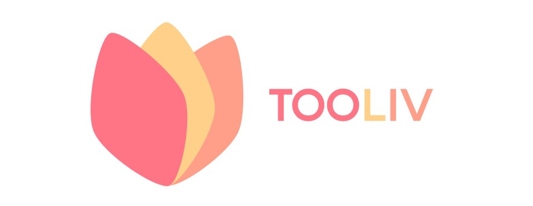

   
  
   
   

## 📆 프로젝트 기간
### 22.04.11 ~ 
- 기획 및 설계 : 22.04.11 ~ 22.04.15
- 프로젝트 구현 : 22.04.18 ~ 
- 버그 수정 및 산출물 정리 : 

  

## 👪 팀원 소개
<table>
    <tr>
        <td height="140px" align="center"> <a href="https://github.com/changhyuns">
                👑 손창현  (Back-End) </a>  </td>
        <td height="140px" align="center"> <a href="https://github.com/thdalstn6352">
                🙂 송민수  (Front-End) </a>  </td>
        <td height="140px" align="center"> <a href="https://github.com/dayaeLee777">
                😆 이다예  (Back-End) </a>  </td>
        <td height="140px" align="center"> <a href="https://github.com/Jubi-In">
                😁 인주비  (Front-End) </a>  </td>
        <td height="140px" align="center"> <a href="https://github.com/JeongHongJin">
                🙄 정홍진  (Back-End) </a>  </td>
        <td height="140px" align="center"> <a href="https://github.com/jejinmyeong">
                😶 제진명  (Front-End) </a>  </td>
    </tr>
    <tr>
        <td align="center">REST API </td>
        <td align="center">UI/UX </td>
        <td align="center">REST API </td>
        <td align="center">UI/UX </td>
        <td align="center">REST API </td>
        <td align="center">UI/UX </td>
    </tr>
</table>

  
